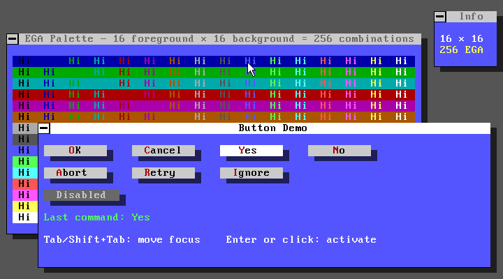

# Retro.TUI.Framework

> Framework TUI multiplataforma para C-Sharp .NET basado en SkiaSharp,  
> inspirado en Turbo Vision con estética retro de PC Tools 9.x.

[](LICENSE.md)
[](https://dotnet.microsoft.com/download/dotnet/10.0)
[]()
[](https://github.com/OscarNET-SOFTware/Retro.TUI.Framework/actions)
[](https://github.com/OscarNET-SOFTware/Retro.TUI.Framework)
[](https://www.nuget.org/packages/Retro.TUI.Core)
[](https://www.nuget.org/packages/Retro.TUI.Core)

> 📖 [English version](README.md)



---

## Índice

1. [Visión general](#1-visión-general)
2. [Qué es y qué no es](#2-qué-es-y-qué-no-es)
3. [Inspiración y referencias](#3-inspiración-y-referencias)
4. [Decisiones de diseño](#4-decisiones-de-diseño)
5. [Estructura de la solución](#5-estructura-de-la-solución)
6. [Arquitectura en capas](#6-arquitectura-en-capas)
7. [Roadmap](#7-roadmap)
8. [Documentación técnica detallada](#8-documentación-técnica-detallada)

+ [Requisitos](#requisitos)
+ [Contribuir](#contribuir)
+ [Licencias de terceros](#licencias-de-terceros)
+ [Licencia](#licencia)
+ [Marcas registradas y reconocimientos](#marcas-registradas-y-reconocimientos)

---

## 1. Visión general

**Retro.TUI.Framework** es un framework .NET para construir aplicaciones con interfaz
de usuario de texto (TUI), con las siguientes características fundamentales:

- **Multiplataforma real**: Windows, Linux y macOS desde el mismo código base.
- **Renderizado vectorial**: SkiaSharp como motor de dibujo, con fuentes bitmap
  embebidas y paleta de colores EGA/CGA auténtica.
- **Modelo de componentes**: árbol de vistas jerarquizado, sistema de eventos tipado,
  gestión de foco y modal stack, inspirado en la arquitectura de Turbo Vision.
- **Paleta EGA fija**: paleta de 16 colores EGA con roles de color semánticos
  (`TuiColorRole`). Los colores son fijos y fieles a la estética de PC Tools 9.x
  de Central Point Software.
- **Idiomático en C#**: nomenclatura, patrones y convenciones propias de C# moderno
  (.NET 10+). No es una traducción 1:1 de Turbo Vision.

---

## 2. Qué es y qué no es

### Es

- Un framework para construir aplicaciones TUI de escritorio con aspecto retro.
- Una librería reutilizable y distribuible como paquetes NuGet independientes por capa.
- Una base extensible sobre la que construir controles y comportamientos propios.

### No es

- Un emulador de terminal ni un framework para aplicaciones de consola.
- Una reimplementación directa de Turbo Vision. Adopta su filosofía y sus patrones,
  pero los adapta al ecosistema .NET moderno.
- Una aplicación concreta. El proyecto incluye una app de muestra (`samples/`) pero
  el framework es independiente de ella.

---

## 3. Inspiración y referencias

### Turbo Vision (Borland, 1990)

Turbo Vision fue un framework TUI para C++ y Pascal que introdujo conceptos avanzados:
árbol de vistas, sistema de eventos, modal stack, paletas semánticas y composición
de componentes. Este framework adopta su filosofía y la traduce al paradigma C# moderno.

| Concepto Turbo Vision | Equivalente en Retro.TUI |
|---|---|
| `TView` | `TuiView` |
| `TGroup` | `TuiGroup` |
| `TApplication` | `TuiApplication` |
| `TEvent` (struct con union) | Jerarquía de `record` con `TuiEvent` |
| Paleta numérica (`tpXxx`) | `TuiColorRole` (enum semántico) |
| `TDeskTop` | `TuiDesktop` |
| `TWindow` / `TDialog` | `TuiWindow` / `TuiDialog` |
| `TMenuBar` / `TStatusLine` | `TuiMenuBar` / `TuiStatusBar` |

### PC Tools 9.x (Central Point Software, ~1991)

Referencia estética visual. Características reproducidas:

- Paleta EGA estándar de 16 colores mapeada a roles semánticos, con dos grises
  adicionales no EGA para barras de título inactivas y pistas de scroll bar.
- Fuente monoespaciada IBM VGA (PxPlus IBM VGA 9x16), integrada como recurso
  en `Retro.TUI.Theming`.
- Barra de título de la aplicación al estilo de Norton/PCTools.
- Bordes de ventana con líneas geométricas (no caracteres Unicode para dibujar recuadros).
- Sombras semitransparentes en ventanas y cuadros de diálogo.
- Barra de menú y barra de estado con la combinación de colores característica.

---

## 4. Decisiones de diseño

### 4.1 Host de ventanas: SDL2 + SkiaSharp

**Decisión**: SDL2 (mediante enlace .NET a través de Silk.NET) como host de ventanas y entrada.
SkiaSharp como motor de renderizado 2D.

**Justificación**:
- SDL2 se centra exclusivamente en la gestión de ventanas, entrada de teclado/ratón y el contexto de renderizado.
  No impone ningún modelo de interfaz de usuario propio.
- SkiaSharp proporciona renderizado vectorial 2D de alta calidad con soporte para fuentes,
  suavizado de bordes controlable y acceso directo a primitivas gráficas.
- Verdaderamente multiplataforma: la misma API en Windows, Linux y macOS.

### 4.2 Prefijo de clase: `Tui`

**Decisión**: Todas las clases públicas del framework utilizan el prefijo `Tui`.

**Justificación**: Evita conflictos con `System.*` (`View`, `Window`, `Application`,
`Label`, `Control`...), SkiaSharp (prefijo `SK`) y SDL2 (prefijo `SDL`).

Ejemplos: `TuiView`, `TuiDialog`, `TuiMenuBar`, `TuiPalette`, `TuiTheme`.

### 4.3 Sistema de eventos: Registros .NET + Canal\<T\>

**Decisión**: jerarquía de `abstract record TuiEvent` con subtipos para cada tipo de evento.
Cola implementada con `System.Threading.Channels.Channel<TuiEvent>`.

### 4.4 Sistema de color: paleta EGA fija + roles semánticos

**Decisión**: el esquema de color es fijo y está definido en tres clases estáticas —
`TuiEgaPalette` (16 constantes de color EGA canónicas), `TuiColorMap` (mapeo interno
de `TuiColorRole` a `SKColor`) y `TuiPalette` (método público estático
`Resolve(TuiColorRole)`). `TuiTheme` es una clase estática que contiene únicamente
parámetros de tipografía y sombra.

Ningún control tiene colores predefinidos. Todo el código de renderizado resuelve
los colores a través de `TuiPalette.Resolve(TuiColorRole)`.

### 4.5 Proyectos separados por capa

**Decisión**: cada capa es un proyecto `.csproj` independiente.

**Justificación**: garantiza las dependencias entre capas en tiempo de compilación, permite la distribución independiente de NuGet por capa y facilita las pruebas unitarias por capa.

### 4.6 Nomenclatura y convenciones

El framework sigue las convenciones oficiales de C# en todo momento:
`PascalCase`, `_camelCase` para campos privados, prefijo `I` para interfaces,
comentarios XML en toda la API pública, tipos de referencia anulables habilitados,
`record` para tipos de valor inmutables, métodos setter de `init` exclusivos para la configuración.

---

## 5. Estructura de la solución

```
Retro.TUI.Framework.sln
│
├── docs/
│   └── architecture.md            Diseño técnico detallado
│
├── samples/
│   └── Retro.TUI.Sample.Basic/    Aplicación de demostración básica
│
├── src/
│   ├── Retro.TUI.Core/            Aplicación, bucle de mensajes
│   ├── Retro.TUI.Events/          Jerarquía de eventos y comandos
│   ├── Retro.TUI.Hosting/         Host de ventana y entrada (SDL2)
│   ├── Retro.TUI.Rendering/       Motor de renderizado (SkiaSharp)
│   ├── Retro.TUI.Theming/         Paletas, temas y roles de color
│   ├── Retro.TUI.Views/           TuiView, TuiGroup, TuiDesktop
│   ├── Retro.TUI.Widgets/         Controles estándar
│   └── Retro.TUI.Windows/         TuiWindow, TuiDialog
│
└── tests/
    ├── Retro.TUI.Core.Tests/
    ├── Retro.TUI.Events.Tests/
    ├── Retro.TUI.Hosting.Tests/
    ├── Retro.TUI.Rendering.Tests/
    ├── Retro.TUI.Theming.Tests/
    ├── Retro.TUI.Views.Tests/
    ├── Retro.TUI.Widgets.Tests/
    └── Retro.TUI.Windows.Tests/
```

### Dependencias del proyecto

Las dependencias siguen estrictamente la estructura de capas.
Ninguna capa inferior conoce a ninguna capa superior.

```
Retro.TUI.Widgets
    └── Retro.TUI.Windows
            └── Retro.TUI.Views
                    └── Retro.TUI.Core
                            ├── Retro.TUI.Rendering
                            │       ├── Retro.TUI.Theming
                            │       └── Retro.TUI.Events
                            └── Retro.TUI.Hosting
                                    └── Retro.TUI.Events
```

---

## 6. Arquitectura en capas

```
┌──────────────────────────────────────────────────────┐
│                   WIDGETS LAYER                      │
│   TuiMenuBar · TuiStatusBar · TuiButton · TuiLabel   │
│   TuiInputLine · TuiCheckBox · TuiRadioButton · ...  │
├──────────────────────────────────────────────────────┤
│                   WINDOWS LAYER                      │
│           TuiWindow · TuiDialog                      │
├──────────────────────────────────────────────────────┤
│                    VIEWS LAYER                       │
│         TuiView · TuiGroup · TuiDesktop              │
├──────────────────────────────────────────────────────┤
│                    CORE LAYER                        │
│         TuiApplication · TuiMessageLoop              │
├───────────────────────┬──────────────────────────────┤
│    RENDERING LAYER    │       HOSTING LAYER          │
│  TuiRenderContext     │   ITuiHost · SdlHost         │
│  TuiGrid · TuiFont    │   ITuiInputProvider          │
├───────────────────────┴──────────────────────────────┤
│              THEMING LAYER                           │
│    TuiTheme · TuiPalette · TuiColorRole              │
├──────────────────────────────────────────────────────┤
│               EVENTS LAYER                           │
│   TuiEvent (record hierarchy) · TuiCommand           │
│   TuiEventQueue · TuiKey · TuiModifiers              │
└──────────────────────────────────────────────────────┘
```

Para obtener información técnica completa sobre cada capa, consulta:

→ **[docs/architecture.es.md](docs/architecture.es.md)**

---

## 7. Roadmap

| Milestone | Versión | Contenido |
|---|---|---|
| 1 — Cimientos | `v0.1.0` | Hosting, Rendering, Theming, Events |
| 2 — Árbol de vistas | `v0.2.0` | Views, Core, Application loop |
| 3 — Ventanas | `v0.3.0` | TuiWindow, TuiDialog, modal stack |
| 4 — Controles base (Widgets) | `v0.4.0` | MenuBar, StatusBar, Button, Input |
| 5 — Controles avanzados | `v0.5.0` | CheckBox, RadioButton, ListBox, ScrollBar |
| 6 — App de muestra | `v1.0.0` | PC Tools 9 desktop sample |

### Milestone 1 — Cimientos (Hosting + Rendering + Theming + Events)
`v0.1.0`

- [x] ✅ `Retro.TUI.Events`: jerarquía de registros, `TuiCommand`, `TuiKey`
- [x] ✅ `Retro.TUI.Theming`: `TuiColorRole`, `TuiEgaPalette`, `TuiColorMap`,
  `TuiPalette` (estático), `TuiTheme` (estático) — fuente IBM VGA embebida como recurso
- [x] ✅ `Retro.TUI.Hosting`: `ITuiHost`, `SdlHost`
- [x] ✅ `Retro.TUI.Rendering`: `TuiRenderContext`, `TuiGrid`, `TuiFont`

### Milestone 2 — Árbol de vistas (Views + Core)
`v0.2.0`

- [x] ✅ `Retro.TUI.Views`: `TuiView`, `TuiGroup`, `TuiDesktop`
- [x] ✅ `Retro.TUI.Core`: `TuiApplication`, `TuiMessageLoop`, `TuiFocusManager`
- [x] ✅ Envío de eventos de teclado y ratón al árbol
- [x] ✅ Cursor de ratón personalizado

### Milestone 3 — Ventanas
`v0.3.0` ✅

- [x] ✅ `TuiWindow` con título, borde y sombra
- [x] ✅ `TuiDialog` con pila modal (`IModalDialog`, `TuiDesktop.PushModal/PopModal`)
- [x] ✅ Arrastrar ventana con el ratón (mouse capture vía `_capturedView`)
- [x] ✅ Z-order (traer al frente al hacer clic)
- [x] ✅ `TuiApplication.RunModal` — bucle de eventos anidado, ciclo de vida automático
- [x] ✅ Enrutado modal — teclado, ratón y comandos restringidos al modal activo

### Milestone 4 — Controles base (Widgets)
`v0.4.0`

- [ ] `TuiMenuBar` con apertura de menú y desplazamiento del cursor
- [ ] `TuiStatusBar` con teclas de función
- [ ] `TuiButton` / `TuiCommand`
- [x] ✅ `TuiLabel`
- [ ] `TuiInputLine` con cursor parpadeante y edición básica

### Milestone 5 — Controles avanzados
`v0.5.0`

- [ ] `TuiCheckBox`
- [ ] `TuiRadioButton` con grupos
- [ ] `TuiListBox`
- [ ] `TuiScrollBar`
- [ ] Menús desplegables (`TuiMenu`, `TuiMenuItem`)

### Milestone 6 — App de muestra
`v1.0.0`

- [ ] `Retro.TUI.Sample.PcTools`: reproducción del escritorio de PC Tools 9
- [ ] Documentación de uso del Framework

---

## 8. Documentación técnica detallada

| Documento | Contenido |
|---|---|
| [docs/architecture.es.md](docs/architecture.es.md) | Contratos, eventos, tematización, ciclo de vida, árbol de vistas |

---

## Requisitos

- .NET 10 SDK (`10.0.300` o superior)
- Visual Studio 2026 o VS Code con C# Dev Kit
- Librerías nativas SDL2 (Windows: incluidas vía NuGet; Linux/macOS: paquete del sistema)
- Compatible con Windows 10+, Ubuntu 20.04+, macOS 12+

## Contribuir

Ver [CONTRIBUTING.md](CONTRIBUTING.md) para la estrategia de ramas, convenciones
de commits y guías de código.

## Licencias de terceros

Ver [THIRD-PARTY-NOTICES.md](THIRD-PARTY-NOTICES.md).

## Licencia

Este proyecto está licenciado bajo la [Licencia MIT](LICENSE.md).  
© 2026 Oscar Fernandez Gonzalez a.k.a. Osc@rNET y Colaboradores

## Marcas registradas y reconocimientos

Este proyecto no está afiliado, respaldado ni patrocinado por ninguna de las siguientes empresas o productos:

- **Turbo Vision** es una marca registrada de Embarcadero Technologies, Inc.
- **PC Tools** era una marca registrada de Central Point Software, Inc.,
  adquirida posteriormente por Symantec Corporation.
- **Norton** es una marca registrada de Gen Digital Inc.
- **IBM** es una marca registrada de International Business Machines Corporation.

La estética retro y los conceptos arquitectónicos utilizados en este proyecto están inspirados
en estos productos con fines educativos y nostálgicos únicamente.
Todas las marcas registradas son propiedad de sus respectivos dueños.
